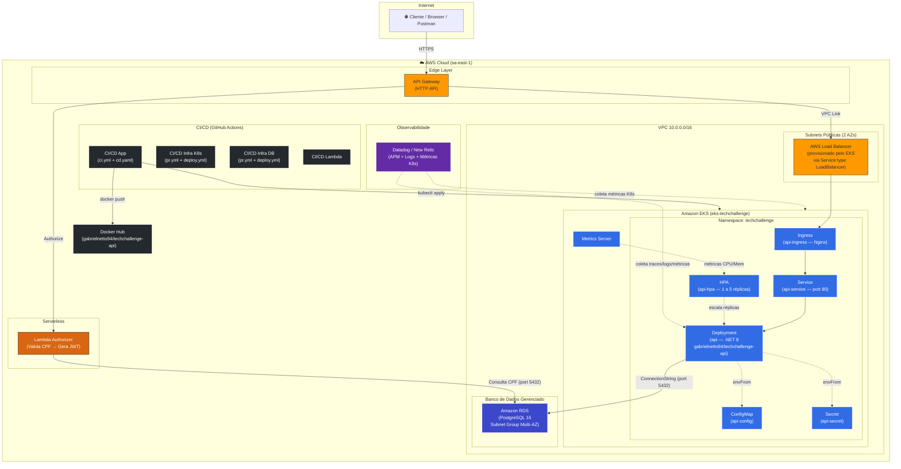

# Diagrama de Componentes — Visão de Nuvem (Tech Challenge Fase 3)

Contempla a visão completa de infraestrutura AWS e local: API Gateway, Lambda Authorizer, EKS, RDS, CI/CD e Monitoramento.

> **Requisito**: TC Fase 3 — *"Diagrama de Componentes (com a visão de nuvem, APIs, banco e monitoramento)."*

---

## 1. Diagrama de Componentes — Infraestrutura AWS



---

## 2. Legenda de Repositórios

| Repositório | Responsabilidade | Componentes Provisionados | Pipelines CI/CD |
|---|---|---|---|
| `tech-challenge-infra-k8s` | IaC Kubernetes (Terraform) | VPC, Subnets, SG, IGW, IAM Roles, EKS Cluster, Node Group, API Gateway, VPC Link | `pr.yml` + `deploy.yml` |
| `tech-challenge-infra-db` | IaC Banco de Dados (Terraform) | RDS PostgreSQL 16, DB Subnet Group, Security Group RDS | `pr.yml` + `deploy.yml` |
| `tech-challenge-auth-serverless` | Função Serverless de Autenticação | Lambda Function (Valida CPF, Gera JWT) | CI/CD Lambda |
| `fase1-tech-challenge` | Aplicação .NET 8 + Manifestos K8s | Deployment, Service, HPA, Ingress, ConfigMap, Secret, Namespace | `ci.yml` + `cd.yaml` + `sonar.yaml` |

---

## 3. Detalhamento dos Componentes Kubernetes (Namespace `techchallenge`)

| Recurso | Arquivo | Descrição |
|---|---|---|
| `Namespace` | `k8s/base/namespace.yaml` | Namespace isolado `techchallenge` para todos os recursos da aplicação |
| `Deployment` | `k8s/base/deployment.yaml` | Pod `.NET 8` com imagem `gabrielnetto94/techchallenge-api`, probes de liveness/readiness/startup, resource limits (100m-500m CPU, 128Mi-512Mi Mem) |
| `Service` | `k8s/overlays/aws/service.yaml` | `type: LoadBalancer` na AWS (provisiona ALB/NLB automaticamente via AWS Cloud Controller) |
| `Ingress` | `k8s/base/ingress.yaml` | Roteamento via Nginx Ingress Controller para `api.techchallenge.local` |
| `HPA` | `k8s/base/hpa.yaml` | Auto-scaling de 1 a 5 réplicas (CPU ≥ 50%, Memória ≥ 95%) |
| `ConfigMap` | `k8s/base/configmap.yaml` | Variáveis não sensíveis: `ASPNETCORE_URLS`, `Jwt__Issuer`, `Jwt__Audience` |
| `Secret` | `k8s/overlays/aws/secrets.yaml` | ConnectionString e credenciais (valores específicos por ambiente) |
| `Metrics Server` | `k8s/metrics-server/` | Coleta de métricas de CPU e Memória dos Pods para o HPA |

---

## 4. Fluxo de Dados Resumido

```
Cliente → API Gateway → Lambda Authorizer → (Valida CPF no RDS) → JWT
          ↓
     VPC Link → Load Balancer → Ingress → Service → Deployment (Pods .NET 8) → RDS PostgreSQL
                                                         ↑
                                                    HPA ← Metrics Server
                                                         ↑
                                                  Datadog/New Relic (APM)
```

---