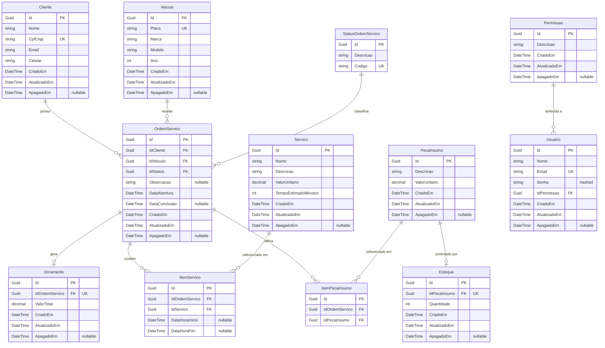
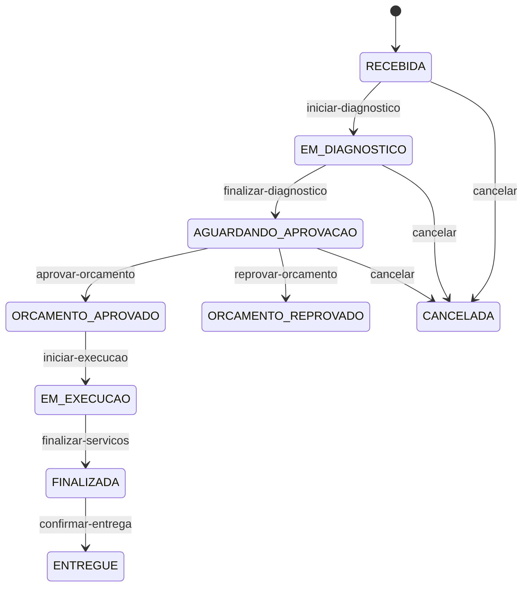

# Modelo Relacional e Diagrama ER — Tech Challenge Fase 3

Justificativa formal para a escolha do banco de dados, detalhamento completo do modelo relacional, diagrama ER e explicação de cada relacionamento.

---

## 1. Justificativa Formal da Escolha do Banco de Dados

### Por que PostgreSQL?

O domínio da oficina mecânica é intrinsecamente **relacional e transacional**. Cada Ordem de Serviço vincula um Cliente a um Veículo, carrega uma máquina de estados com 9 transições possíveis, e agrega itens de serviço e peças/insumos com cálculos financeiros que exigem atomicidade. Optar por um banco NoSQL exigiria reimplementar garantias de integridade referencial (Foreign Keys, Cascade) e controle de transações ACID no código da aplicação — um risco injustificável para um sistema de gestão financeira.

### Por que Gerenciado (AWS RDS)?

A decisão de utilizar o Amazon RDS em vez de hospedar o PostgreSQL dentro do próprio cluster Kubernetes elimina o overhead operacional de gerenciar backups, patching de segurança, failover e monitoramento de disco. O time pode focar exclusivamente na lógica de negócio enquanto a AWS cuida da infraestrutura de dados.

Detalhes completos da análise estão documentados na [RFC-002 — Escolha do Banco de Dados Gerenciado](./rfcs/RFC-002-managed-database-choice.md).

---

## 2. Diagrama ER Completo

O diagrama abaixo representa **todas as entidades** presentes no domínio da aplicação, com suas propriedades e cardinalidades reais extraídas do código-fonte (`src/Fiap.TechChallenge.Domain/Entities/`).

---

## 3. Explicação dos Relacionamentos

### 3.1 Cliente → OrdemServico (1:N)
Um **Cliente** pode ter **múltiplas** Ordens de Serviço ao longo do tempo (cada vez que traz um veículo para manutenção). Cada OS pertence a exatamente um Cliente, identificado pela FK `IdCliente`.

### 3.2 Veiculo → OrdemServico (1:N)
Um **Veículo** pode estar vinculado a **múltiplas** Ordens de Serviço (manutenções recorrentes). Cada OS se refere a exatamente um Veículo, identificado pela FK `IdVeiculo`.

### 3.3 StatusOrdemServico → OrdemServico (1:N)
O **StatusOrdemServico** é uma entidade separada (tabela de lookup) e não um Enum no banco de dados. Essa decisão foi tomada para permitir que novos status sejam criados ou renomeados sem necessidade de deploy ou migração, e para que os nomes e códigos dos status sejam consultáveis diretamente via SQL e exibidos em relatórios sem mapeamento adicional. Cada OS possui exatamente um status corrente, referenciado pela FK `IdStatus`.

**Status cadastrados no sistema:**

| Código | Descrição | Transição Anterior |
|---|---|---|
| `RECEBIDA` | Recebida | *(estado inicial)* |
| `EM_DIAGNOSTICO` | Em Diagnóstico | Recebida |
| `AGUARDANDO_APROVACAO` | Aguardando Aprovação | Em Diagnóstico |
| `ORCAMENTO_APROVADO` | Orçamento Aprovado | Aguardando Aprovação |
| `ORCAMENTO_REPROVADO` | Orçamento Reprovado | Aguardando Aprovação |
| `EM_EXECUCAO` | Em Execução | Orçamento Aprovado |
| `FINALIZADA` | Finalizada | Em Execução |
| `ENTREGUE` | Entregue | Finalizada |
| `CANCELADA` | Cancelada | *(qualquer estado)* |

### 3.4 OrdemServico → Orcamento (1:1)
Cada OS possui **no máximo um** Orçamento calculado automaticamente a partir da soma dos valores unitários dos serviços e peças/insumos associados. O Orçamento é criado quando os primeiros itens são adicionados à OS e recalculado a cada alteração. A FK `IdOrdemServico` no Orçamento é unique.

### 3.5 OrdemServico ↔ Servico (N:M via ItemServico)
A relação entre Ordens de Serviço e Serviços do catálogo é **muitos-para-muitos**, materializada na tabela associativa `ItemServico`. Cada registro armazena adicionalmente os campos `DataHoraInicio` e `DataHoraFim`, permitindo rastrear o tempo real de execução de cada serviço individual dentro de uma OS — dado essencial para os dashboards de "tempo médio por status" exigidos na observabilidade.

### 3.6 OrdemServico ↔ PecaInsumo (N:M via ItemPecaInsumo)
Analogamente, a relação entre OS e Peças/Insumos é **muitos-para-muitos** via `ItemPecaInsumo`. Cada registro referencia uma peça/insumo utilizado naquela OS.

### 3.7 PecaInsumo → Estoque (1:1)
Cada PecaInsumo cadastrada possui **um** registro de Estoque que controla a quantidade disponível. O estoque é gerenciado via operações de adição e remoção, com validação de saldo mínimo (`Quantidade >= 0`) aplicada no domínio.

### 3.8 Permissao → Usuario (1:N)
Cada **Usuário** do sistema (operadores, mecânicos, administradores) possui exatamente uma **Permissão** (role). A Permissão define o nível de acesso do usuário nas rotas protegidas da API. Múltiplos usuários podem compartilhar a mesma permissão.

---

## 4. Decisões de Modelagem e Ajustes no Modelo Relacional

### 4.1 StatusOrdemServico como Tabela, não Enum
**Justificativa**: Utilizar um Enum (`int`) no banco traria problemas de manutenção. Com uma tabela dedicada:
- Novos status podem ser adicionados sem migração de schema.
- Queries de relatório retornam diretamente o nome legível do status (`JOIN` natural).
- O EF Core faz o mapeamento transparente via Navigation Property (`OrdemServico.Status`).

### 4.2 Orcamento como Entidade Separada
**Justificativa**: Separar o orçamento da OS permite:
- Auditoria independente (timestamps `CriadoEm`, `AtualizadoEm` próprios).
- Recálculo automático sem alterar os campos da OS.
- Extensibilidade futura para múltiplos orçamentos (versões de orçamento).

### 4.3 Soft Delete via `ApagadoEm`
**Justificativa**: Todas as entidades auditáveis (`EntidadeAuditavel`) possuem o campo `ApagadoEm` (nullable). Em vez de `DELETE` físico, o sistema marca o registro com a data/hora da exclusão. Isso garante rastreabilidade completa e permite recuperação de dados por período.

### 4.4 Value Objects para Validação de Domínio
Campos como `CPF/CNPJ`, `Email`, `Placa`, `Valor Monetário` e `Senha` são modelados como **Value Objects** no DDD (pasta `ValueObjects/`). No banco de dados, esses VOs são mapeados como colunas simples pelo EF Core (`OwnsOne`), mas toda a validação de formato e regras de negócio reside no domínio, nunca no banco.

---

## 5. Diagrama de Máquina de Estados da OS

