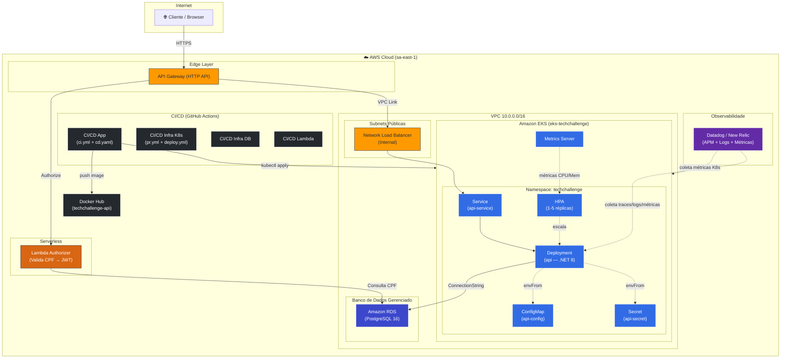
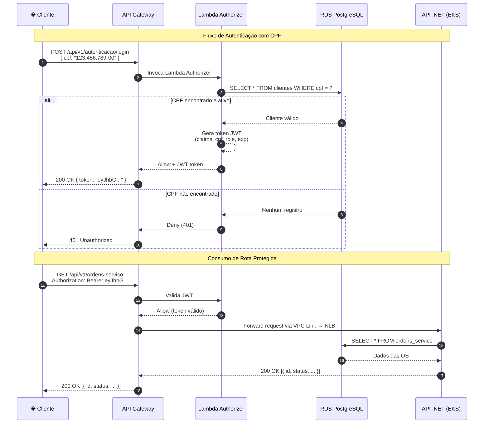
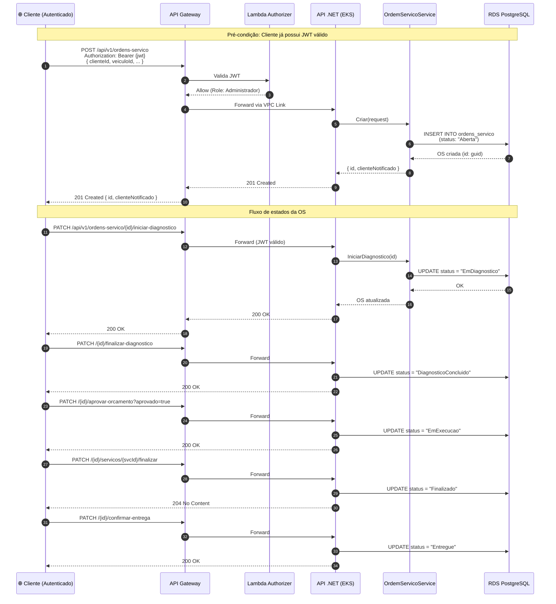
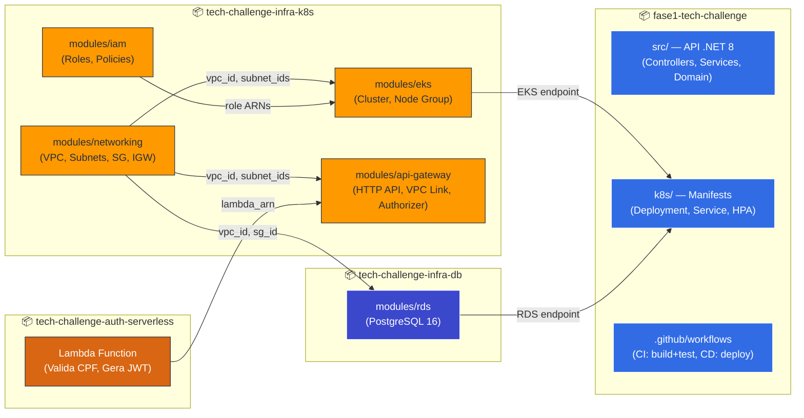

# Diagramas de Arquitetura — Tech Challenge Fase 3

## 1. Diagrama de Componentes (Visão de Nuvem)

Contempla a visão completa da infraestrutura AWS: API Gateway, Lambda Authorizer, EKS, RDS e Monitoramento.

### Legenda de Repositórios

| Repositório | Responsabilidade | Componentes Provisionados |
|---|---|---|
| `tech-challenge-infra-k8s` | IaC Kubernetes (Terraform) | VPC, IAM, EKS, API Gateway, VPC Link |
| `tech-challenge-infra-db` | IaC Banco de Dados (Terraform) | RDS PostgreSQL |
| `tech-challenge-auth-serverless` | Lambda Serverless | Lambda Authorizer |
| `fase1-tech-challenge` | Aplicação .NET + Manifests K8s | Deployment, Service, HPA, ConfigMap, Secret, CI/CD |

---

## 2. Diagrama de Sequência — Autenticação (CPF → JWT)

Fluxo completo de quando um cliente se autentica com CPF via API Gateway e Lambda Authorizer.

---

## 3. Diagrama de Sequência — Abertura de Ordem de Serviço

Fluxo completo desde a autenticação até a criação da OS e suas transições de estado.

---

## 4. Mapa de Componentes por Repositório

