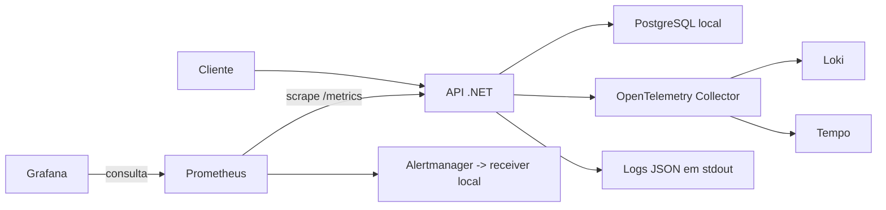

# Observabilidade

## Situação validada

Configuração versionada. Prometheus + Grafana é a solução oficial de monitoramento e
dashboards deste projeto; Datadog e New Relic não são pré-requisitos. A validação runtime do Compose foi executada em 07/09/2026:
268 testes passaram, a API respondeu aos healthchecks, os targets do Prometheus ficaram
`UP`, o dashboard e os três datasources foram provisionados, o Loki recebeu logs e o
Tempo recebeu traces. A validação em Kubernetes local foi concluída em 09/09/2026 com
Kind: API e PostgreSQL ficaram saudáveis; o ServiceMonitor ficou `UP`; o Blackbox Probe
retornou `probe_success=1`; o HPA recebeu CPU/memória reais; e as regras de alerta e o
dashboard foram carregados. As evidências e limitações remanescentes estão no
[relatório de validação](validation-report.md).

Prometheus/Grafana exibem métricas. O Compose inclui Loki, Tempo e OpenTelemetry
Collector: quando os serviços estão ativos, a API envia logs, traces e métricas OTLP
ao collector, que encaminha logs ao Loki e traces ao Tempo. O Alertmanager entrega
alertas ao receiver local, cujos eventos aparecem nos logs de alert-receiver.
O Blackbox Exporter sonda /health/ready e alimenta o alerta de uptime.

A API usa OpenTelemetry para instrumentação. O ambiente local usa Prometheus para scraping,
Grafana para dashboards e Alertmanager para alertas. O envio via OTLP continua opcional:
quando OTEL_EXPORTER_OTLP_ENDPOINT está configurado, traces e métricas também podem ser
enviados para um collector externo.

## Endpoints operacionais

| Endpoint | Uso |
|---|---|
| /health/live | Liveness probe, sem dependências externas |
| /health/ready | Readiness probe, valida conexão com PostgreSQL |
| /health | Diagnóstico completo dos healthchecks |
| /metrics | Métricas Prometheus para scraping |
| /swagger | Swagger UI da API |

## Métricas de negócio

| Métrica | Tags | Objetivo |
|---|---|---|
| techchallenge.orders.created | status | Volume de ordens criadas por período |
| techchallenge.orders.status.duration | status | Duração das etapas diagnostico, execucao e finalizacao |
| techchallenge.orders.processing.failures | operation | Falhas HTTP 5xx no processamento de ordens |
| techchallenge.integrations.requests | integration, result | Chamadas para integrações externas |
| techchallenge.integrations.errors | integration, operation | Erros de integrações externas |
| techchallenge.http.request.duration | method, status_code | Latência das requisições |

O fluxo das etapas é persistido com data_inicio_diagnostico, o intervalo dos serviços é obtido pelos timestamps dos itens e a etapa de finalização usa data_conclusao até a entrega.

## Logs e correlação

Os logs são emitidos em JSON no stdout. Cada requisição recebe ou propaga o header X-Correlation-ID, devolvido também na resposta e incluído no escopo dos logs junto com o trace_id.

## Stack local

O docker-compose.yml sobe a API, Prometheus, Grafana e Alertmanager:

    # PowerShell: somente se .env ainda não existir, preservando a configuração existente
    if (-not (Test-Path .env)) { Copy-Item .env.example .env }
    docker compose up -d

| Serviço | Endereço | Credenciais |
|---|---|---|
| Grafana | http://localhost:3000 | admin / admin |
| Prometheus | http://localhost:9090 | sem autenticação |
| Alertmanager | http://localhost:9093 | sem autenticação |
| Loki | http://localhost:3100 | sem autenticação |
| Tempo | http://localhost:3200 | sem autenticação |
| Blackbox Exporter | http://localhost:9115 | sem autenticação |
| Receiver de alertas | http://localhost:9094 | sem autenticação |

O dashboard Tech Challenge - Observabilidade é provisionado automaticamente e cobre:
volume diário de ordens, tempo médio por etapa, latência p95, erros de integração,
falhas de processamento e, quando o Prometheus estiver no Kubernetes, CPU e memória dos pods.

O volume é uma estimativa em janela móvel de 24 horas; a média de etapas considera
eventos concluídos nos últimos 5 minutos. Sem eventos/amostras, séries podem não existir
ou resultar em painel sem dados. Não há coleta de métricas Kubernetes no Compose.
O painel de CPU usa proporção sobre requests, não percentual da capacidade do nó.

As regras locais ficam em observability/prometheus/alerts.yml. Em um cluster Kubernetes,
as regras equivalentes ficam em k8s/observability/prometheusrule.yaml.

## Logs e traces

No Compose, a API envia OTLP para o OpenTelemetry Collector. O Collector encaminha
logs para o Loki e traces para o Tempo; ambos aparecem como datasources no Grafana.
O log continua sendo emitido em JSON no stdout, permitindo também a inspeção com
docker compose logs.

Para enviar para um collector externo, configure:

    OTEL_SERVICE_NAME=techchallenge-api
    OTEL_EXPORTER_OTLP_PROTOCOL=http/protobuf
    OTEL_EXPORTER_OTLP_ENDPOINT=http://datadog-agent.datadog.svc.cluster.local:4318

No Kubernetes, o overlay local deixa o endpoint vazio porque não há Collector implantado
junto da aplicação. Para centralizar logs/traces no cluster, forneça um endpoint OTLP
acessível e defina OTEL_EXPORTER_OTLP_ENDPOINT no ConfigMap do ambiente.

## Arquitetura local configurada

No Kubernetes, kubelet/cAdvisor fornece CPU e memória dos containers e kube-state-metrics
fornece estado e requests dos pods. O Metrics Server usado pelo HPA não substitui essa
coleta. A instalação está documentada no [README Kubernetes](../k8s/README.md).

## Roteiro de aceite operacional

1. Iniciar Docker e executar o Compose com .env configurado; conferir docker compose ps.
2. Consultar /health/live, /health/ready e /metrics; confirmar o target UP no Prometheus.
3. Abrir o dashboard Tech Challenge - Observabilidade e verificar nomes de métricas,
   consultas e unidades contra o conteúdo efetivamente exportado em /metrics.
4. Gerar tráfego com clientes sintéticos e ordens passando por Diagnóstico, Execução e
   Finalização; aguardar pelo menos dois scrapes e comparar as métricas aos eventos gerados.
5. Em ambiente de teste, provocar falha de integração/OS e verificar o alerta após o
   intervalo configurado; conferir o JSON recebido em alert-receiver.
6. Enviar X-Correlation-ID e verificar resposta, metadados de correlação no log do Loki e
   trace no Tempo da mesma requisição, inclusive em respostas 400/500. No teste runtime,
   o header foi preservado, o Loki recebeu `correlation_id`/`trace_id` como metadados
   estruturados e o Tempo recebeu traces; ainda falta registrar uma resposta 400/500 no vídeo.
7. No cluster local, instalar também o Blackbox Exporter e aplicar ServiceMonitor,
   Probe e PrometheusRule; confirmar CPU/memória, probes e comportamento diante de
   indisponibilidade. Este roteiro foi concluído em Kind em 09/09/2026, exceto pela
   demonstração visual em vídeo e por um canal externo de notificação, caso a equipe
   queira um além do Alertmanager.

Executar cada port-forward em um terminal separado. No Windows, os scripts .sh podem
ser chamados com Git Bash; não dependem obrigatoriamente de WSL. O uso de admin/admin
é apenas configuração de demonstração; as portas atuais do Compose também aceitam
conexões fora do localhost se a rede/firewall permitir.
