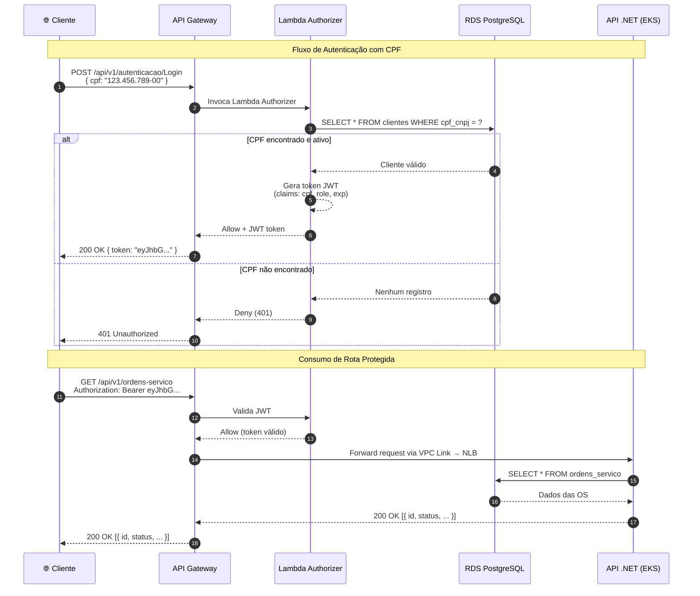
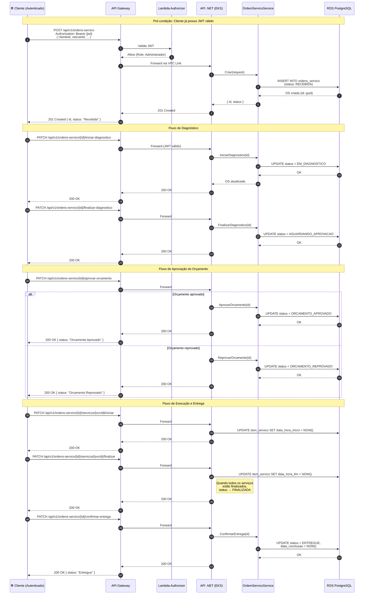
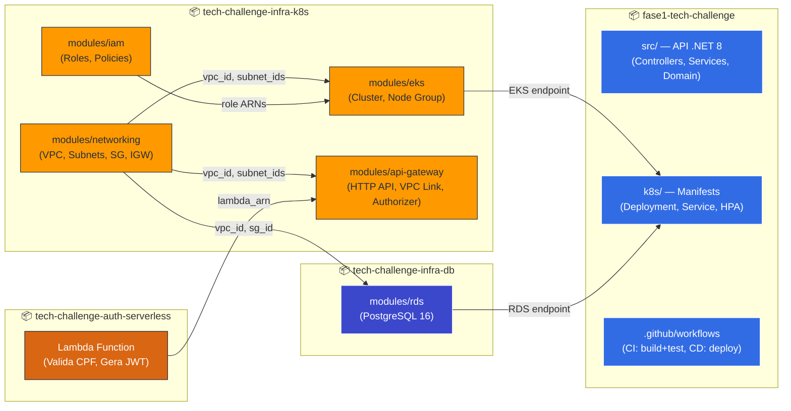

# Diagramas de Arquitetura — Tech Challenge Fase 3

## 1. Diagrama de Sequência — Autenticação (CPF → JWT)

Fluxo completo de quando um cliente se autentica com CPF via API Gateway e Lambda Authorizer.

---

## 2. Diagrama de Sequência — Abertura e Ciclo de Vida da Ordem de Serviço

Fluxo completo desde a criação da OS até a entrega, passando por todas as transições de estado reais do sistema.

> **Referência**: Os status abaixo correspondem exatamente aos códigos definidos em `StatusOS` (`src/Fiap.TechChallenge.Domain/Entities/StatusOrdemServico.cs`).

---

## 3. Mapa de Componentes por Repositório

