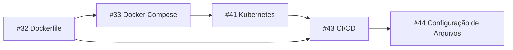

# 📋 Plano de Execução — Issues Atribuídas

Revisão das 5 issues com análise do que **já está feito** vs **o que falta**, organizadas na ordem ideal de execução (cada issue depende da anterior).

---

## 🔢 Ordem de Execução



---

## 1️⃣ Issue #32 — Otimizar Dockerfile para Produção

| Checklist | Status | Observação |
|---|---|---|
| Build multi-stage (SDK → Runtime) | ✅ Feito | `Dockerfile` já tem Stage 1 (build) e Stage 2 (runtime) |
| Imagem de runtime enxuta | ✅ Feito | Usa `aspnet:8.0` (~220MB vs ~2GB do SDK) |
| Usuário não-root | ❌ **Falta** | Container roda como `root` por padrão |
| API inicializa corretamente | ✅ Feito | `ENTRYPOINT ["dotnet", "Fiap.TechChallenge.Api.dll"]` OK |

### O que falta fazer:
Apenas **1 item**: adicionar um usuário não-root no Dockerfile. É uma mudança de ~3 linhas:
```diff
 FROM mcr.microsoft.com/dotnet/aspnet:8.0 AS runtime
 WORKDIR /app
 COPY --from=build /app/publish .
+
+# Segurança: rodar como usuário não-root
+RUN adduser --disabled-password --no-create-home appuser
+USER appuser
+
 ENV ASPNETCORE_URLS=http://+:8080
```

> [!TIP]
> **Esforço estimado:** ~5 minutos. Issue praticamente concluída.

---

## 2️⃣ Issue #33 — Melhorias no Docker Compose

| Checklist | Status | Observação |
|---|---|---|
| Healthcheck no banco de dados | ✅ Feito | `pg_isready` com interval/timeout/retries configurados |
| `depends_on` com `condition: service_healthy` | ✅ Feito | API só sobe quando o banco está saudável |
| Extrair credenciais para arquivo `.env` | ❌ **Falta** | Senhas estão hardcoded direto no `docker-compose.yml` |

### O que falta fazer:
Criar um arquivo `.env` (não versionado, já está no `.gitignore`) e referenciar as variáveis no `docker-compose.yml`:

**Criar `.env`:**
```env
POSTGRES_DB=techchallengedb-dev
POSTGRES_USER=postgres
POSTGRES_PASSWORD=postgres
API_PORT=8080
```

**Atualizar `docker-compose.yml`:**
```yaml
environment:
  POSTGRES_DB: ${POSTGRES_DB}
  POSTGRES_USER: ${POSTGRES_USER}
  POSTGRES_PASSWORD: ${POSTGRES_PASSWORD}
```

Também criar um `.env.example` (versionado) como template para outros desenvolvedores.

> [!TIP]
> **Esforço estimado:** ~15 minutos.

---

## 3️⃣ Issue #41 — Orquestração com Kubernetes (K8s)

| Checklist | Status | Observação |
|---|---|---|
| Deployments | ✅ Feito | `api-deployment.yaml`, `postgres-deployment.yaml` |
| Services | ✅ Feito | `api-service.yaml` (NodePort), `postgres-service` (ClusterIP) |
| ConfigMaps | ✅ Feito | `configmap.yaml` (api-config + postgres-config) |
| Secrets | ✅ Feito | `secret.yaml` (api-secret + postgres-secret), `dockerhub-secret.yaml` |
| HPA (Horizontal Pod Autoscaler) | ✅ Feito | `hpa.yaml` com CPU (70%) e memória (80%), escala de 2→10 pods |

### Extras já implementados (além do pedido):
- ✅ Ingress (`api-ingress.yaml`) com NGINX Ingress Controller (`ingress-controller.yaml`)
- ✅ Namespace isolado (`namespace.yaml`)
- ✅ PersistentVolumeClaim para o PostgreSQL
- ✅ Probes (readiness, liveness, startup) na API

> [!IMPORTANT]
> **Esta issue está 100% concluída!** Pode ser fechada.

---

## 4️⃣ Issue #43 — Integração Contínua / Entrega Contínua (CI/CD)

| Checklist | Status | Observação |
|---|---|---|
| Build da aplicação | ✅ Feito | CI (`ci.yml`) e CD (`cd.yaml`) fazem `dotnet build` |
| Execução dos testes | ✅ Feito | `dotnet test` nos dois workflows |
| Build da imagem Docker | ✅ Feito | CD faz build com `docker/build-push-action` |
| Push da imagem para Docker Hub | ✅ Feito | CD envia com tags `latest` e `sha256-*` |
| Deploy no cluster Kubernetes | ⚠️ **Comentado** | Job `deploy-k8s` existe mas está comentado |
| Deploy do banco de dados | ⚠️ **Comentado** | Faz parte do job comentado acima |
| Aplicação dos manifestos YAML | ⚠️ **Comentado** | Faz parte do job comentado acima |

### O que falta fazer:
O Job 3 (`deploy-k8s`) já está escrito no `cd.yaml`, mas está **inteiramente comentado**. Para ativá-lo, é preciso:

1. **Descomentar** o bloco do job `deploy-k8s` no `cd.yaml`
2. **Configurar o Secret** `KUBECONFIG` no repositório GitHub (Settings → Secrets → Actions). Esse secret contém o kubeconfig base64 do cluster de produção
3. **Ajustar a branch trigger** — hoje o CD roda na branch `feat/infra` (e `main` está comentada). Precisa decidir o fluxo final:
   - Apenas `main`? (mais seguro)
   - `main` + `feat/infra`?

### Pontos de atenção:
- O CI (`ci.yml`) usa `actions/checkout@v4` e `setup-dotnet@v4`, enquanto o CD usa `@v7` e `@v5`. **Padronizar as versões**
- O CI faz restore com `.slnx`, mas o CD faz restore com `.csproj`. **Padronizar**
- Não existe pasta `/infra` (Terraform) — a issue #44 menciona scripts Terraform

> [!WARNING]
> **Dependência externa:** O job de deploy precisa de um cluster Kubernetes de produção acessível (EKS, AKS, GKE, etc.) e o kubeconfig como secret no GitHub. Sem isso, o job vai falhar.

> [!TIP]
> **Esforço estimado:** ~30 minutos (descomentar + padronizar + configurar secrets).

---

## 5️⃣ Issue #44 — Configuração de Arquivos

| Checklist | Status | Observação |
|---|---|---|
| Dockerfile e docker-compose revisados | ✅/⚠️ | Falta apenas o usuário não-root (#32) e `.env` (#33) |
| Manifestos Kubernetes em `/k8s` | ✅ Feito | 11 arquivos completos e declarativos |
| Scripts Terraform em `/infra` | ❌ **Falta** | Pasta `/infra` não existe |
| Arquivos de configuração da pipeline CI/CD | ✅/⚠️ | CI e CD existem, falta descomentar deploy K8s (#43) |

### O que falta fazer:
Esta issue é essencialmente uma **checklist de revisão** das outras issues. A única novidade é o **Terraform** (`/infra`). Isso depende de qual provedor de nuvem vocês vão usar (AWS, Azure, GCP).

Se for AWS (EKS), por exemplo, seria criar:
```
infra/
├── main.tf          # Provider AWS + backend S3
├── eks.tf           # Cluster EKS
├── vpc.tf           # Rede VPC
├── variables.tf     # Variáveis
└── outputs.tf       # Outputs (endpoint do cluster, etc.)
```

> [!IMPORTANT]
> Esta é a issue mais abrangente. **Deve ser a última a ser fechada**, pois ela depende de todas as outras (#32, #33, #41, #43).

---

## 📊 Resumo Geral

| Issue | Progresso | Esforço Restante | Prioridade |
|---|---|---|---|
| **#41** K8s | ✅ 100% | Pode fechar agora | — |
| **#32** Dockerfile | 🟡 90% | ~5 min (user não-root) | 1ª |
| **#33** Docker Compose | 🟡 70% | ~15 min (arquivo .env) | 2ª |
| **#43** CI/CD | 🟡 75% | ~30 min (descomentar deploy + padronizar) | 3ª |
| **#44** Config Arquivos | 🟠 60% | Depende das demais + Terraform | 4ª (última) |

> [!NOTE]
> **Tempo total estimado para fechar tudo:** ~1-2 horas (sem contar Terraform, que depende de definição de cloud provider).
