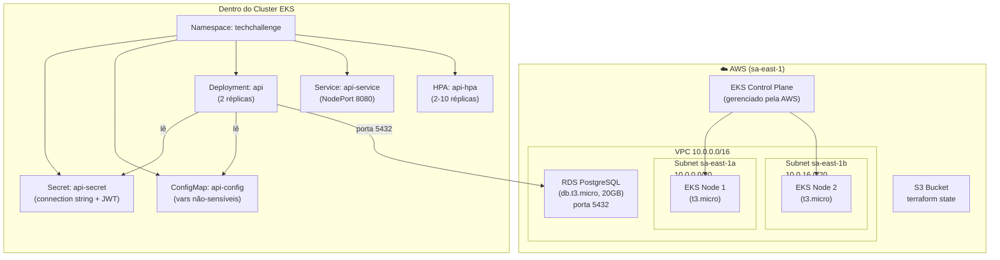

# Guia Completo — Terraform + EKS + K8s + RDS

## 🏗️ Visão Geral da Arquitetura



---

## 📁 Estrutura dos Repositórios

```
terraform-soat/                          ← Infraestrutura (IaC)
├── backend.tf          S3 remoto para guardar o estado do Terraform
├── providers.tf        Provider AWS (região, versão)
├── vars.tf             Variáveis (região, nome, senha RDS, etc)
├── terraform.tfvars    Valores sensíveis (NÃO commitar!)
├── vpc.tf              VPC (rede virtual privada)
├── subnet.tf           2 subnets públicas (1 por AZ)
├── internet-gateway.tf Gateway de internet
├── route-table.tf      Tabela de rotas → internet
├── sg.tf               Security Group do EKS
├── iam-role.tf         IAM Roles (cluster + nodes)
├── eks-cluster.tf      Cluster EKS (control plane)
├── eks-node.tf         Node Group (máquinas EC2)
├── access-entry.tf     Permissão do usuário IAM ao cluster
├── rds.tf              RDS PostgreSQL + SG + Subnet Group
├── bucket.tf           Bucket S3 (state backend)
├── data-source.tf      Data source do IAM user
└── outputs.tf          Valores de saída (endpoint, host RDS, etc)

fase1-tech-challenge/k8s/               ← Manifests Kubernetes
├── namespace.yaml       Namespace "techchallenge"
├── secrets.yaml         Secrets (DockerHub, API, ConnectionString)
├── configmap.yaml       ConfigMap (vars não-sensíveis)
├── api-deployment.yaml  Deployment da API .NET (2 réplicas)
├── api-service.yaml     Service NodePort (porta 8080)
├── api-ingress.yaml     Ingress (roteamento HTTP)
└── hpa.yaml             Horizontal Pod Autoscaler
```

---

## 🔐 Como os Secrets Funcionam

### Fluxo completo de uma credencial

```mermaid
sequenceDiagram
    participant TF as Terraform<br/>(terraform.tfvars)
    participant RDS as AWS RDS
    participant DEV as Desenvolvedor
    participant SEC as K8s Secret<br/>(secrets.yaml)
    participant POD as Pod da API

    TF->>RDS: Cria banco com password="MinhaSenh@123"
    TF-->>DEV: terraform output rds_connection_string
    DEV->>DEV: echo -n "Host=...;Password=MinhaSenh@123" | base64 -w 0
    DEV->>SEC: Cola o valor base64 no secrets.yaml
    DEV->>SEC: kubectl apply -f secrets.yaml
    SEC-->>POD: Monta como variável de ambiente
    POD->>RDS: Conecta usando a connection string
```

### Anatomia de um Secret K8s

```yaml
apiVersion: v1
kind: Secret
metadata:
  name: api-secret
  namespace: techchallenge    # ← precisa estar no mesmo namespace do Pod
type: Opaque                  # ← tipo genérico (chave/valor)
data:
  # Os valores são SEMPRE em base64
  # Para codificar:  echo -n "meu valor" | base64 -w 0
  # Para decodificar: echo "bWV1IHZhbG9y" | base64 -d
  Jwt__Secret: "UWlJUmQycUtZNDd..."
  ConnectionStrings__DefaultConnection: "SG9zdD1maWFwLXNv..."
```

### Como o Pod lê o Secret

```yaml
# No api-deployment.yaml:
envFrom:
  - secretRef:
      name: api-secret      # ← nome do Secret
  - configMapRef:
      name: api-config       # ← nome do ConfigMap
```

Isso injeta TODAS as chaves do Secret como variáveis de ambiente no container:
- `ConnectionStrings__DefaultConnection` → valor decodificado do base64
- `Jwt__Secret` → valor decodificado do base64

O .NET lê automaticamente via `configuration.GetConnectionString("DefaultConnection")`.

### Comandos úteis para Secrets

```bash
# Ver quais secrets existem no namespace
kubectl get secrets -n techchallenge

# Ver o conteúdo decodificado de um secret específico
kubectl get secret api-secret -n techchallenge \
  -o jsonpath='{.data.ConnectionStrings__DefaultConnection}' | base64 -d

# Criar um secret interativamente (sem YAML)
kubectl create secret generic meu-secret \
  --namespace=techchallenge \
  --from-literal=CHAVE=valor

# Deletar e recriar um secret
kubectl delete secret api-secret -n techchallenge
kubectl apply -f secrets.yaml
```

> [!WARNING]
> **Secrets K8s NÃO são criptografados por padrão** — são apenas base64 (codificação, não criptografia). Em produção, use **Sealed Secrets**, **External Secrets Operator**, ou **AWS Secrets Manager**.

---

## 🚀 Passo a Passo Completo (do Zero ao Deploy)

### Fase 1 — Provisionar a Infraestrutura (Terraform)

```bash
cd ~/Desktop/terraform-soat

# 1. Criar o arquivo de variáveis sensíveis (NÃO commitar)
cat > terraform.tfvars <<EOF
rds_password = "MinhaSenh@Segura123"
EOF

# 2. Inicializar o Terraform (baixa providers, configura backend)
terraform init
#   → Baixa o provider hashicorp/aws
#   → Conecta ao backend S3 para guardar o estado

# 3. Ver o que vai ser criado (preview, sem executar nada)
terraform plan
#   → Mostra: "+ create" para cada recurso que será criado
#   → Verifica se tem erros de configuração

# 4. Aplicar a infraestrutura (cria tudo na AWS)
terraform apply
#   → Pede confirmação "yes"
#   → Cria: VPC, Subnets, SG, IAM Roles, EKS, Nodes, RDS, S3
#   → Demora ~10min (EKS ~6min, RDS ~7min)
#   → No final, mostra os Outputs

# 5. Ver os outputs (valores que precisamos para o K8s)
terraform output                          # todos
terraform output eks_cluster_name         # nome do cluster
terraform output rds_host                 # hostname do RDS
terraform output -raw rds_connection_string  # connection string completa
```

#### O que cada comando do Terraform faz

| Comando | O que faz |
|---------|-----------|
| `terraform init` | Baixa providers, inicializa backend S3. **Roda 1x** (ou quando muda provider/backend) |
| `terraform plan` | Preview: mostra o que vai criar/alterar/destruir. **Não muda nada** |
| `terraform apply` | Executa o plan. Cria/altera recursos na AWS |
| `terraform output` | Mostra valores de saída definidos em `outputs.tf` |
| `terraform destroy` | **⚠️ PERIGOSO**: apaga TODA a infraestrutura criada |
| `terraform validate` | Verifica se os arquivos .tf têm sintaxe válida |
| `terraform state list` | Lista todos os recursos que o Terraform gerencia |

### Fase 2 — Conectar o kubectl ao Cluster EKS

```bash
# 1. Configurar o kubectl para apontar para o cluster EKS
aws eks update-kubeconfig \
  --name eks-fiap-soat-terraform \
  --region sa-east-1
#   → Grava as credenciais em ~/.kube/config
#   → kubectl agora fala com o cluster EKS

# 2. Verificar conexão
kubectl get nodes
# Deve mostrar:
# NAME                                        STATUS   ROLES    AGE   VERSION
# ip-10-0-24-192.sa-east-1.compute.internal   Ready    <none>   31m   v1.35.6
# ip-10-0-8-33.sa-east-1.compute.internal     Ready    <none>   31m   v1.35.6
```

> [!IMPORTANT]
> O `aws eks update-kubeconfig` precisa do **AWS CLI ≥ 2.7.0**. Versões antigas geram tokens com `v1alpha1` que o kubectl moderno rejeita com `invalid apiVersion`.

### Fase 3 — Preparar os Secrets com dados do RDS

```bash
# 1. Pegar a connection string do Terraform
terraform -chdir=~/Desktop/terraform-soat output -raw rds_connection_string
# Output: Host=fiap-soat-terraformdb.xxx.rds.amazonaws.com;Port=5432;Database=techchallengedb;Username=postgres;Password=SuaSenha

# 2. Converter para base64 (formato do K8s Secret)
echo -n "Host=fiap-soat-terraformdb.xxx.rds.amazonaws.com;Port=5432;Database=techchallengedb;Username=postgres;Password=SuaSenha" | base64 -w 0
# Output: SG9zdD1maWFwLXNv...    ← copiar esse valor

# 3. Colar no secrets.yaml → campo ConnectionStrings__DefaultConnection
```

> [!TIP]
> `-w 0` no `base64` evita quebra de linha. O K8s espera o base64 em **uma única linha**.

### Fase 4 — Aplicar os Manifests Kubernetes

```bash
cd ~/Desktop/fase1-tech-challenge/k8s

# Aplicar na ORDEM CORRETA (dependências primeiro):
kubectl apply -f namespace.yaml      # 1. Cria o namespace
kubectl apply -f secrets.yaml        # 2. Cria os secrets
kubectl apply -f configmap.yaml      # 3. Cria os configmaps
kubectl apply -f api-deployment.yaml # 4. Cria o deployment (pods)
kubectl apply -f api-service.yaml    # 5. Expõe os pods via service
kubectl apply -f api-ingress.yaml    # 6. Roteamento HTTP
kubectl apply -f hpa.yaml            # 7. Auto-scaling

# OU aplicar tudo de uma vez (o K8s resolve a ordem):
kubectl apply -f .
```

### Fase 5 — Verificar e Monitorar

```bash
# Ver todos os recursos no namespace
kubectl get all -n techchallenge

# Ver pods (status deve ser "Running")
kubectl get pods -n techchallenge

# Ver logs da API em tempo real
kubectl logs -n techchallenge -l app.kubernetes.io/name=api -f

# Ver detalhes de um pod com problemas
kubectl describe pod <nome-do-pod> -n techchallenge

# Reiniciar os pods (sem deletar)
kubectl rollout restart deployment/api -n techchallenge

# Ver o service (IP externo se LoadBalancer)
kubectl get svc -n techchallenge
```

---

## 🐛 Erros que Encontramos e Como Resolver

### 1. Bucket S3 não existe
```
Error: S3 bucket "fiap-soat-tf-1" does not exist
```
**Causa**: `backend.tf` apontava para um bucket diferente do que `bucket.tf` cria.
**Solução**: Alinhar os nomes — ambos devem usar o mesmo bucket.

### 2. Versão do PostgreSQL não disponível
```
Cannot find version 16.3 for postgres
```
**Causa**: Nem todas as versões existem em todas as regiões.
**Solução**: Consultar versões disponíveis:
```bash
aws rds describe-db-engine-versions --engine postgres --region sa-east-1 \
  | python3 -c "import sys,json; [print(v['EngineVersion']) for v in json.load(sys.stdin)['DBEngineVersions']]"
```

### 3. Senha inválida no RDS
```
MasterUserPassword is not a valid password. Only printable ASCII characters besides '/', '@', '"', ' '
```
**Causa**: RDS proíbe `/`, `@`, `"` e espaço na senha master.
**Solução**: Usar `terraform.tfvars` com uma senha segura que não contenha esses caracteres.

### 4. kubectl: invalid apiVersion v1alpha1
```
error: exec plugin: invalid apiVersion "client.authentication.k8s.io/v1alpha1"
```
**Causa**: AWS CLI v2.0.30 (antiga) gera tokens v1alpha1; kubectl moderno espera v1beta1.
**Solução**: Atualizar AWS CLI para ≥ 2.7.0:
```bash
curl "https://awscli.amazonaws.com/awscli-exe-linux-x86_64.zip" -o /tmp/awscliv2.zip
unzip -q /tmp/awscliv2.zip -d /tmp/awscli
sudo /tmp/awscli/aws/install --update
```

### 5. Pods não aparecem no `kubectl get pods`
```
No resources found in default namespace.
```
**Causa**: Os pods estão no namespace `techchallenge`, não no `default`.
**Solução**: Sempre usar `-n techchallenge`:
```bash
kubectl get pods -n techchallenge
```

### 6. Pod não conecta ao RDS (Timeout)
```
Failed to connect to 10.0.16.49:5432 → Timeout during connection attempt
```
**Causa**: O Security Group do RDS só liberava o SG criado no Terraform, mas o EKS cria um SG automático nos nodes.
**Solução**: Liberar toda a VPC (CIDR `10.0.0.0/16`) na porta 5432 do `rds_sg`.

### 7. Password authentication failed
```
28P01: password authentication failed for user "postgres"
```
**Causa**: A senha no Secret K8s não batia com a senha real do RDS.
**Solução**: Verificar a senha real via `terraform output -raw rds_connection_string` e atualizar o Secret.

---

## 📊 Mapa de Dados Sensíveis

| Dado | Onde está guardado | Como é consumido |
|------|-------------------|-----------------|
| Senha do RDS | `terraform.tfvars` (local, no `.gitignore`) | Terraform lê e passa para a AWS ao criar o RDS |
| Connection String | `secrets.yaml` → Secret K8s `api-secret` | Pod lê como env var `ConnectionStrings__DefaultConnection` |
| JWT Secret | `secrets.yaml` → Secret K8s `api-secret` | Pod lê como env var `Jwt__Secret` |
| Docker Hub token | `secrets.yaml` → Secret K8s `dockerhub-secret` | Pod usa para puxar imagem privada (`imagePullSecrets`) |
| Terraform state | Bucket S3 `fiap-soat-terraform` | Terraform lê/grava automaticamente |
| kubeconfig | `~/.kube/config` (local) | kubectl lê automaticamente |

---

## 🔄 Fluxo de Atualização (dia a dia)

### Mudou o código da API?
```bash
# 1. Build e push da nova imagem Docker
docker build -t gabrielnetto94/techchallenge-api:v2 .
docker push gabrielnetto94/techchallenge-api:v2

# 2. Atualizar o deployment
kubectl set image deployment/api \
  api=gabrielnetto94/techchallenge-api:v2 \
  -n techchallenge
```

### Mudou a infra (Terraform)?
```bash
cd ~/Desktop/terraform-soat
terraform plan     # ver o que muda
terraform apply    # aplicar
```

### Mudou um manifest K8s?
```bash
cd ~/Desktop/fase1-tech-challenge/k8s
kubectl apply -f arquivo-alterado.yaml

# Se mudou um Secret/ConfigMap, reiniciar os pods:
kubectl rollout restart deployment/api -n techchallenge
```

### Precisa destruir TUDO? (⚠️ cuidado)
```bash
# 1. Remover workloads do cluster
kubectl delete -f ~/Desktop/fase1-tech-challenge/k8s/

# 2. Destruir infraestrutura AWS
cd ~/Desktop/terraform-soat
terraform destroy   # pede confirmação
```
